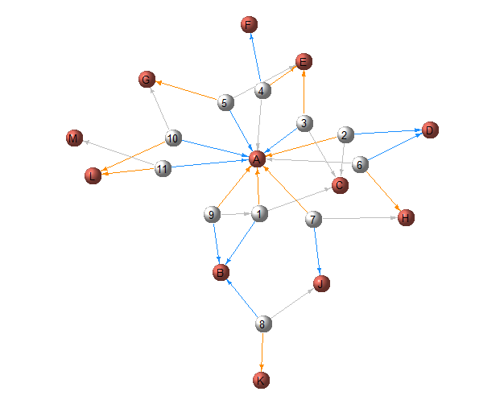

# SNA
In order to know the most influential student in a college group, data was collected (via survey), analyzed and visualized as a netwrok. 

In the survey process, each interviewee student was asked who the most three influential students are. The first name indicates the 1st most influential from the sample perspective, the second name indicates the 2nd most influential, and so on. 

In the dataset, Every interviewee student was given a unique number 1, 2, 3,.. Every student the sample defined as influential was given a unique letter A, B, C, ..  

In the netwrok visualization: 

The vertices were colored as follows:
- White refers to the interviewee students 
- Red refers to the influential students. 

The edges were colored as follows:
- Orange for edges refer to 1st most influential
- Blue for edges refer to 2nd most influential
- Grey for edges refer to 3rd most influential 

As the figure shows, student (A) is the most influential student in the group. Not only a lot of edges refer to him, but also most of these edges are colored in orange which, accroding to the edges colors, indicates that the student (A) mostly is seen as the 1st most influential.   
